# CS3219 Task B

## **Student Information**

Name: Kor Ming Soon
Matriculation Number: A0201975A
Github Repo: https://github.com/kormingsoon/cs3219-taskb

Credit: https://medium.com/@dinyangetoh/how-to-build-simple-restful-api-with-nodejs-expressjsand-mongodb-99348012925d

## **Task B1**
- Local Deployment
- Hosted Deployment
- Error-Resiliency Testing
  
### Local Deployment

In this segment we will run and observe the GET, POST, PUT and DELETE API calls on a locally deployed web application using postman. In this example, we will use contacts, containing the name and email, as the model for our api calls.

1. Ensure that node.js is installed in your computer.

2. Run the app with the following command

        npm start

3. After running the application, go to the following site and observe that the app is running on express.
   
        localhost:8080
    <div style="text-align:center">
        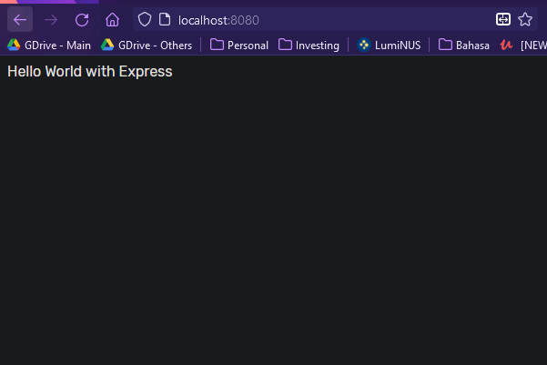
        <p align="center"> localhost:8080 </p>
    </div>

4. You can visit the following links to observe the routing. In ```/contacts```, the data you observe may be different.

        localhost:8080/goto
        localhost:8080/goto/contacts
    <div style="text-align:center">
        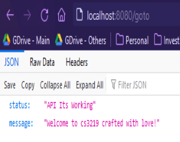
        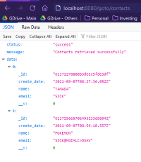
    </div>

5. **Now, we will use postman to carry out the API calls.**

    5.1 For the ```GET``` API request. We can simply see that the requests returns the list of contacts in the database. Right now, there are two contact details. We access: ```localhost:8080/goto/contacts```:

    <div style="text-align:center">
        
    </div>
    <br>

    5.2 For the ```POST``` API request. For the post request, we will be adding in ```name: Sahil is the best``` and ```email: sahilisthebest@gmail.com```. You can then observe that the contact is newly created. You can return back to ```localhost:8080/goto/contacts``` to see all of the contacts.

    <div style="text-align:center">
        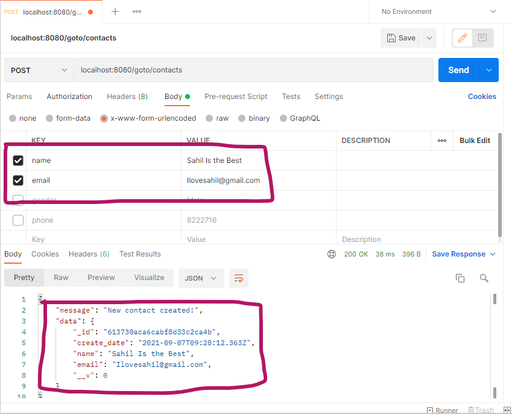
    </div>    

    <br>

    5.3 For the ```DELETE``` API request. For the delete request, we will delete the first contact, which has the id ```61372278808b3deec9fde3df```. We will key in ```localhost:8080/goto/contacts/61372278808b3deec9fde3df``` with a DELETE request.
    
    <div style="text-align:center">
        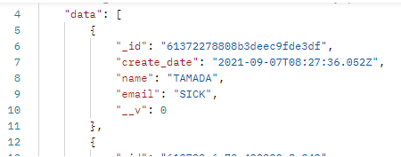
        <p>The above contains the contact with the id that we will delete </p>
        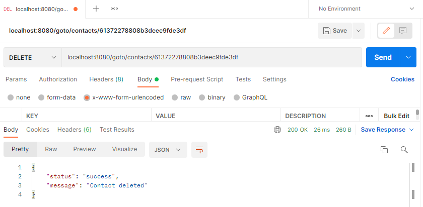
        <p>The above illustrates the delete api through postman. </p>
        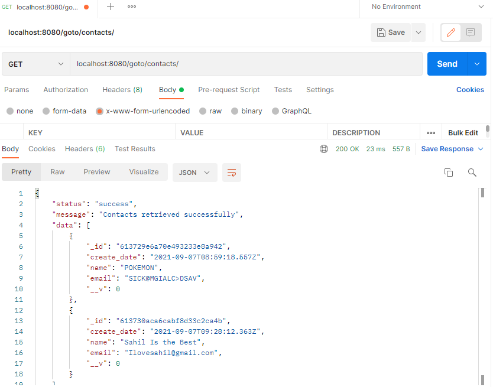
        <p>The above illustrates the difference in the contact list after deletion. </p>
    </div> 

    5.4 For the ```PUT``` API request. We will edit the contact we added earlier (```Sahil is the best```) to a different name ```Prof Bimlesh is the best```, along with the email. Notice that the id remains the same.

    <div style="text-align:center">
        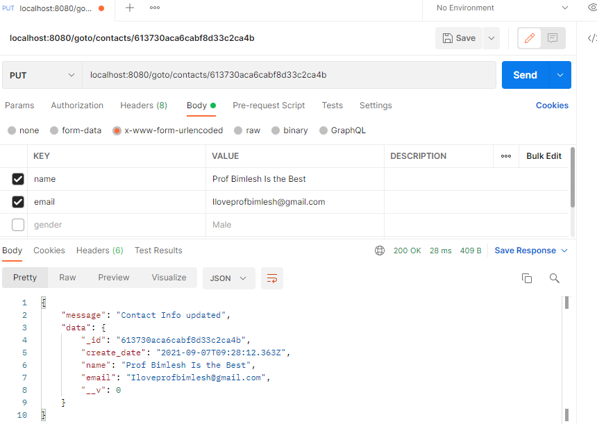
    </div> 

### Hosted Deployment

1. Similar to above, we will illustrate the API calls using the deployed endpoints instead of our localhost. The website is hosted on the link: https://cs3219-ay2122-task-b.herokuapp.com/. We will test the API calls on https://cs3219-ay2122-task-b.herokuapp.com/goto/contacts.
   

    1.1 For the ```GET``` API request. We can simply see that the requests returns the list of contacts in the database. Right now, there are two contact details. We access: ```localhost:8080/goto/contacts```:

    <div style="text-align:center">
        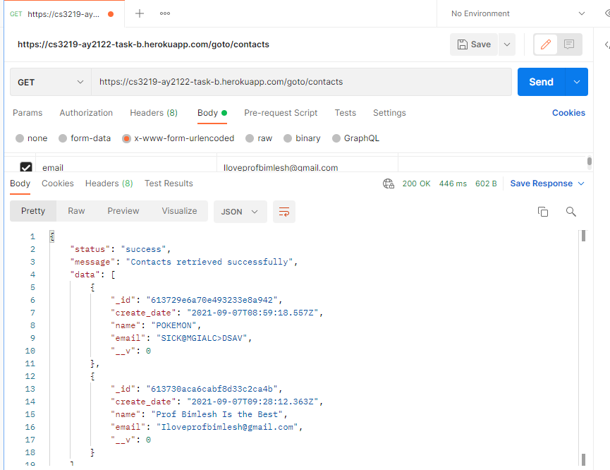
    </div>
    <br>

    1.2 For the ```POST``` API request. For the post request, we will be adding in ```name: Hosting is the best``` and ```email: ilovehosting@gmail.com```. You can then observe that the contact is newly created. You can return back to ```https://cs3219-ay2122-task-b.herokuapp.com/goto/contacts``` to see all of the contacts.

    <div style="text-align:center">
        
    </div>    

    <br>

    1.3 For the ```DELETE``` API request. For the delete request, we will delete the first contact, which has the id ```613729e6a70e493233e8a942```. We will key in ```https://cs3219-ay2122-task-b.herokuapp.com/goto/contacts/613729e6a70e493233e8a942``` with a DELETE request.
    
    <div style="text-align:center">
        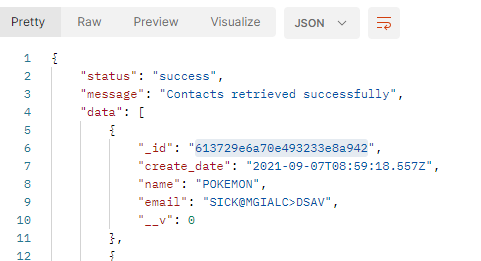
        <p>The above contains the contact with the id that we will delete </p>
        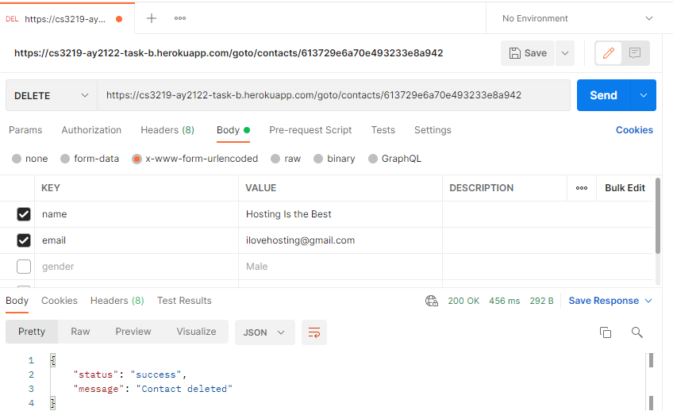
        <p>The above illustrates the delete api through postman. </p>
        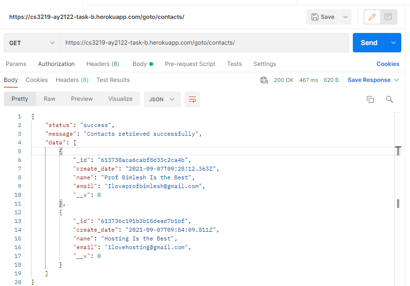
        <p>The above illustrates the difference in the contact list after deletion. </p>
    </div> 

    1.4 For the ```PUT``` API request. We will edit the contact we added earlier (```Hosting is the best```) to a different name ```Local deployment is the best```, along with the email. Notice that the id remains the same.

    <div style="text-align:center">
        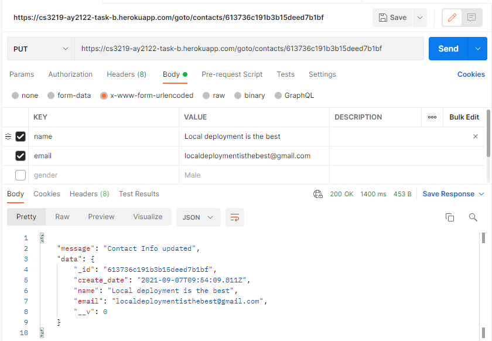
    </div> 

### Error-Resiliency Testing