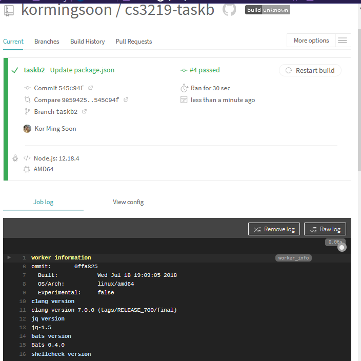
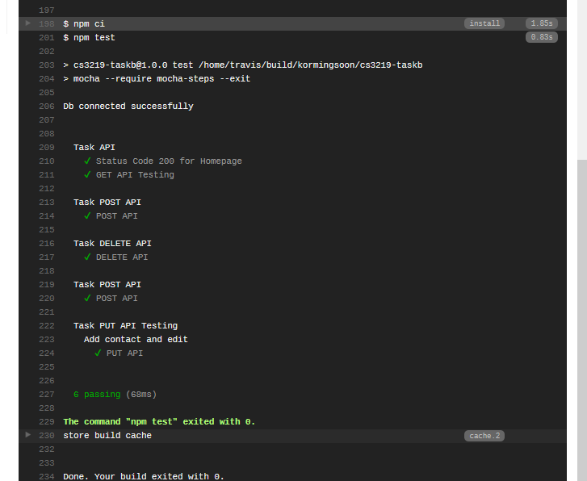

# CS3219 Task B

## **Student Information**

Name: Kor Ming Soon

Matriculation Number: A0201975A

Github Repo: https://github.com/kormingsoon/cs3219-taskb/tree/taskb2

## **Task B2**
- Mocha and Chai Testing
- Travis CI  

### Mocha and Chai Testing
In this segment we will run and observe the GET, POST, PUT and DELETE API calls on a locally deployed web application using postman. In this example, we will use contacts, containing the name and email, as the model for our api calls.

1. Ensure that node.js is installed in your computer.

2. Run the app with the following command

        npm start

3. To access the automated api testing, run the following command 

        npm test

The appTest.js tests all API calls of GET, POST, PUT and DELETE.

### Travis CI
1. For the Travis CI, I have linked in to my repository on taskb2 (branch of taskb). The test is triggered in the travis.yml file with the script: 'npm test'.
 

       
      
 Travis CI Build

 

       
      
 Travis CI Build Test

  